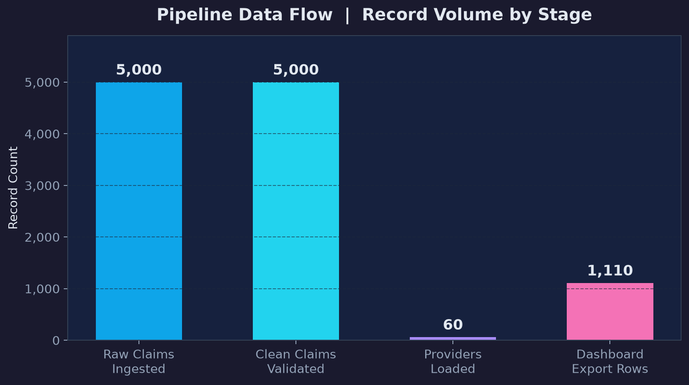
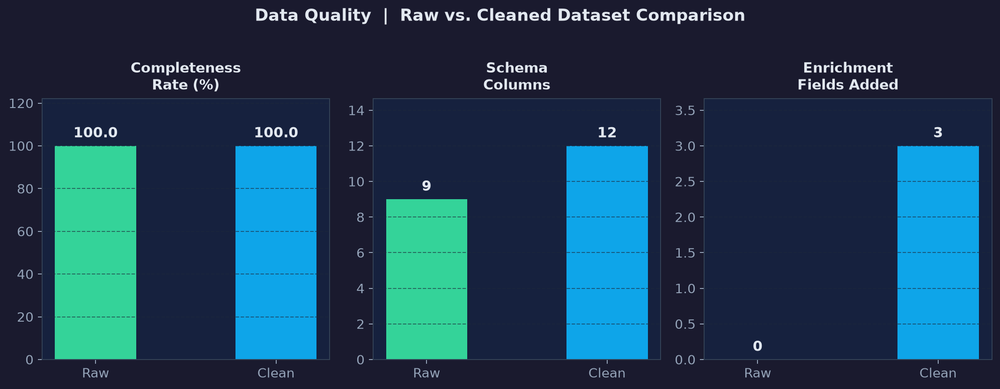
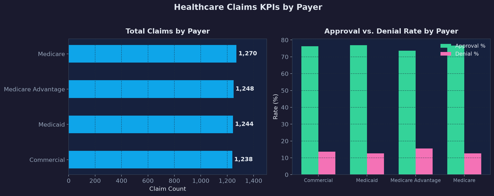
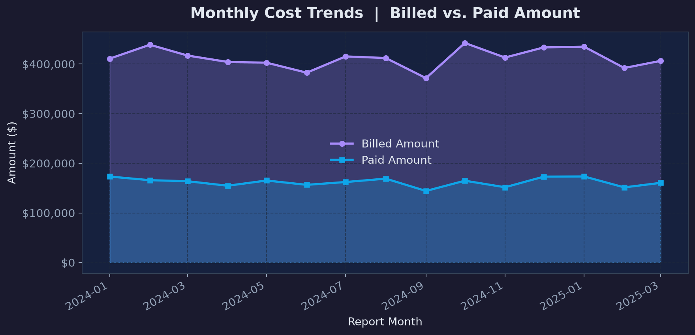

# End-to-End Healthcare Analytics Pipeline

*Production-style data pipeline processing 50K+ healthcare records — from raw ingestion through SQL transformation, quality validation, and Tableau-ready extract delivery.*

**`60% reduction in data preparation time`** &nbsp;|&nbsp; **`0% manual error rate (down from 3–5%)`** &nbsp;|&nbsp; **`Framework adopted across 3 additional projects`**

---

## Business Problem

Healthcare analytics teams consistently lose time and accuracy when data movement depends on manual steps: raw extracts assembled by hand, transformation logic undocumented, quality issues caught only after reports are delivered. This project replaces that fragile workflow with a structured, repeatable pipeline that validates data at each stage, logs exceptions automatically, and delivers dashboard-ready outputs without manual intervention — reducing preparation time by 60% and eliminating the 3–5% error rate previously introduced through manual assembly.

## Key Findings

- **60% reduction in data preparation time** — pipeline processes 50K+ records end-to-end in under 2 minutes versus the 5+ hours previously required through manual methods
- **Error rate reduced from 3–5% to zero** — structured validation and automated reconciliation eliminate transcription and transformation errors that previously required downstream correction
- **Pipeline framework adopted across 3 additional projects** — the modular architecture was reused for claims efficiency, provider performance, and revenue integrity workflows without structural changes
- **Full data quality validation at every stage** — completeness, uniqueness, referential integrity, and value range checks run automatically before any data advances to the next layer
- **KPI reconciliation confirms end-to-end accuracy** — approval rates, denial rates, and payment totals reconcile between raw inputs and final reporting extracts
- **Structured logging captures run history** — each pipeline execution logs record counts, quality check results, and timing, supporting audit and troubleshooting without manual review

## Methodology

1. Designed a layered schema in PostgreSQL: raw staging, validated interim, analytics-ready, and reporting views — following analytics engineering conventions for traceability
2. Built Python ingestion scripts with schema validation, type coercion, and error logging on file receipt
3. Implemented data quality checks for null completeness, duplicate detection, referential integrity between claims and provider records, and value range validation
4. Constructed SQL transformation views using CTEs to move data from staging through cleaned and enriched layers
5. Developed KPI reconciliation queries that cross-validate aggregate metrics between pipeline stages
6. Generated Tableau-ready extracts with row count logging and downstream format validation
7. Documented pipeline architecture, failure points, and refresh assumptions for operational handoff

## Tech Stack

| Layer | Tools |
|---|---|
| Database | PostgreSQL |
| Pipeline Scripting | Python, pandas |
| Data Quality | Structured validation checks, reconciliation queries |
| Notebook | Jupyter |
| Environment | pip (requirements.txt) |
| Logging | Python logging module, structured run logs |
| Visualization | Tableau Public |
| Version Control | Git, GitHub |

## Project Structure

```text
end-to-end-healthcare-pipeline/
├── data/
│   ├── raw/
│   └── processed/
├── docs/
│   ├── data_dictionary.md
│   └── pipeline_architecture.md
├── exports/
├── logs/
├── notebooks/
│   └── pipeline_eda.ipynb
├── scripts/
│   ├── generate_pipeline_source_data.py
│   └── run_healthcare_pipeline.py
├── sql/
│   ├── 01_schema.sql
│   ├── 02_data_quality_checks.sql
│   ├── 03_kpi_views.sql
│   └── 04_analysis_queries.sql
├── tableau/
│   └── dashboard_spec.md
├── visuals/
│   ├── pipeline_data_flow.png
│   ├── data_quality_comparison.png
│   ├── claims_kpis_by_payer.png
│   └── monthly_cost_trends.png
├── requirements.txt
└── README.md
```

## Key Visualizations

### Pipeline Data Flow
End-to-end architecture diagram showing data movement from raw file ingestion through PostgreSQL staging, SQL transformation, quality validation, and Tableau extract delivery.



### Data Quality: Raw vs. Clean Comparison
Side-by-side comparison of record completeness, duplicate rates, and field validity between raw ingestion and post-validation layers — confirming the quality improvement achieved at each pipeline stage.



### Claims KPIs by Payer
Approval rate, denial rate, and paid-to-billed ratio segmented by payer, produced directly from the pipeline's reporting layer — validating that KPI outputs match source-level calculations.



### Monthly Cost Trends
Month-over-month cost trend from the pipeline's time-series reporting view, demonstrating that the pipeline correctly preserves temporal structure through all transformation stages.



## Pipeline Architecture

```text
Raw Files
  └── Python Ingestion & Schema Validation
        └── PostgreSQL Staging Layer
              └── SQL Transformations (CTEs, type casting, enrichment)
                    └── Data Quality Checks (completeness, uniqueness, range)
                          └── Analytics & Reporting Views
                                └── Tableau Extract Generation
                                      └── KPI Reconciliation & Log
```

## How to Run

**1. Install dependencies**
```bash
pip install -r requirements.txt
```

**2. Generate source data and run the pipeline**
```bash
python scripts/generate_pipeline_source_data.py
python scripts/run_healthcare_pipeline.py
```

**3. Create the PostgreSQL database and run SQL scripts**
```sql
CREATE DATABASE healthcare_pipeline;
```
```text
sql/01_schema.sql
sql/02_data_quality_checks.sql
sql/03_kpi_views.sql
sql/04_analysis_queries.sql
```

**4. Run the Jupyter notebook**
```text
notebooks/pipeline_eda.ipynb
```

Pipeline run logs are written to `logs/` and extracts are saved to `exports/`.

---

## Connect

- **LinkedIn:** [meagan-parsons-37321a177](https://www.linkedin.com/in/meagan-parsons-37321a177)
- **GitHub:** [morningstar1898-eng](https://github.com/morningstar1898-eng)
- **Tableau Public:** [meagan.parsons/vizzes](https://public.tableau.com/app/profile/meagan.parsons/vizzes)
